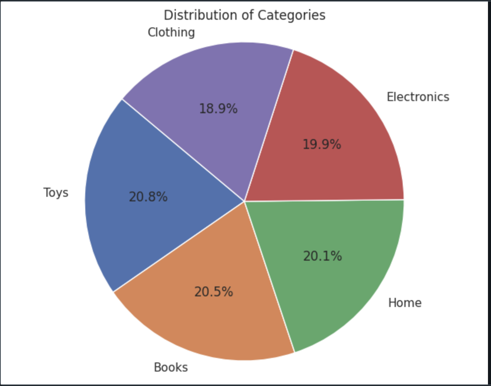
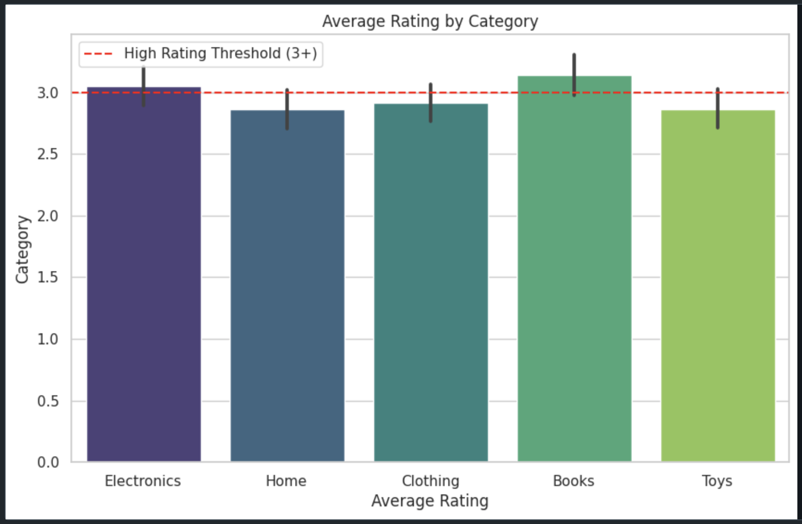
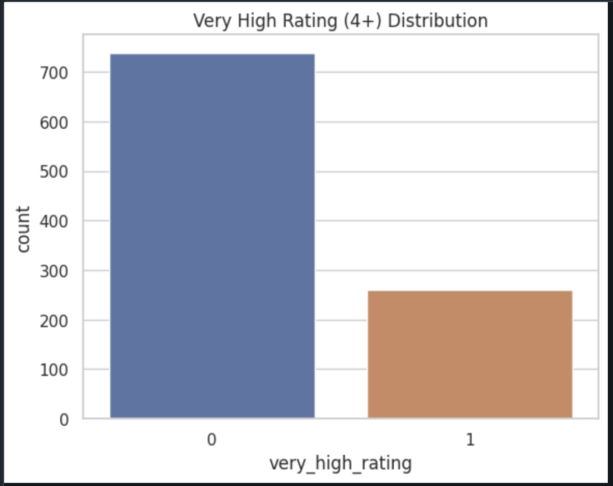
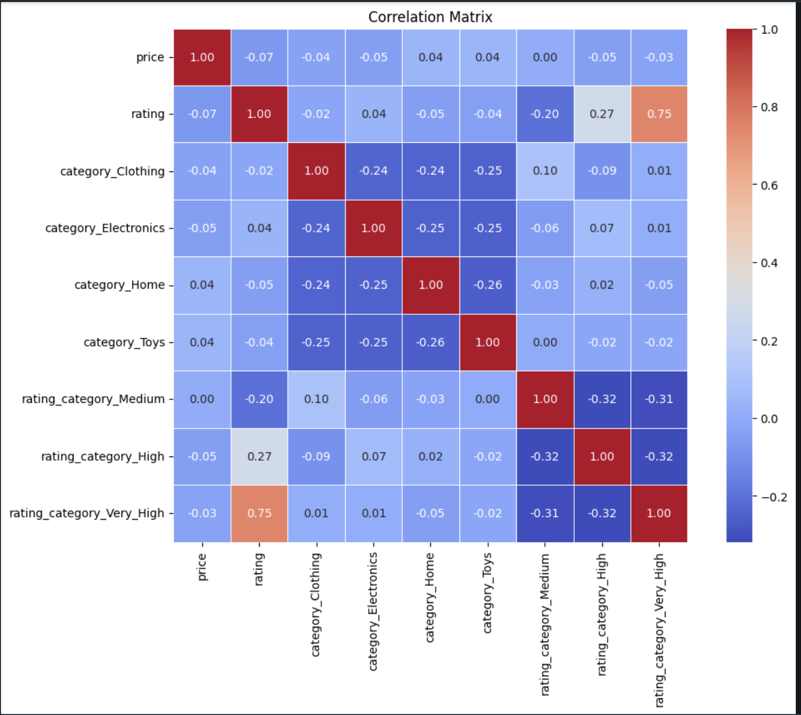
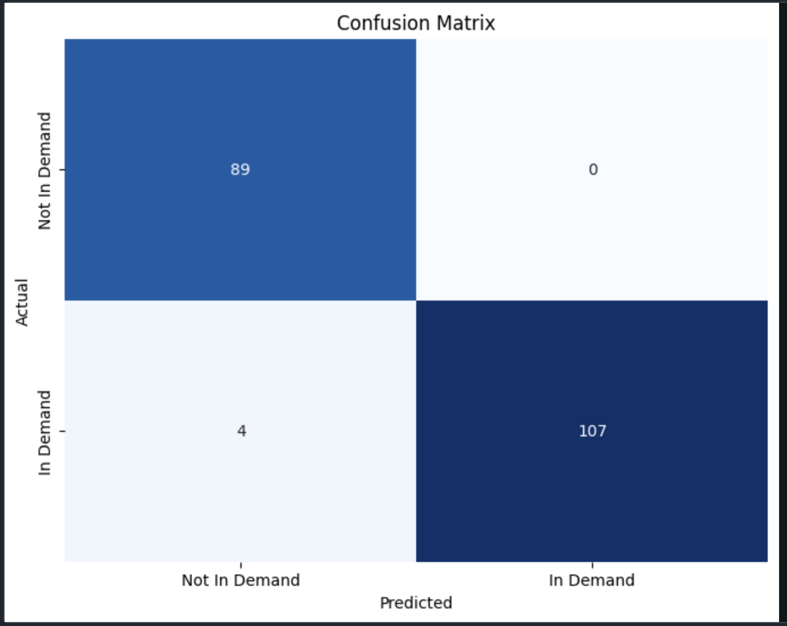
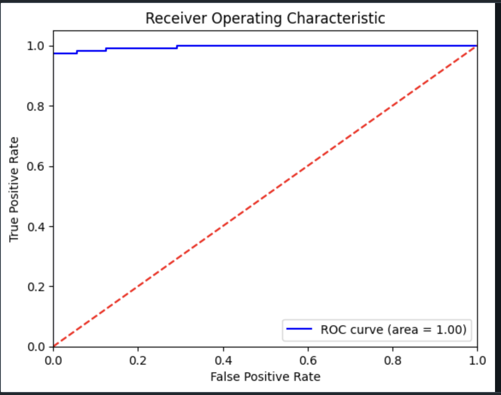

# Smart E-commerce Catalog Data Analysis

## Project Overview

This project, Smart E-commerce Catalog Data Analysis, aims to analyze and enhance product catalog data using Databricks through exploratory data analysis (EDA) and advanced techniques. It involves creating the catalog, database, and table, followed by SQL EDA as the first part of the analysis. Automation is applied extensively within the project, including automating the ETL (Extract, Transform, Load) processes and aspects of data processing, facilitating efficient data handling and reporting. The second part of the analysis features advanced EDA using Python, where methods such as ANOVA, feature engineering, and logistic regression are employed to derive meaningful insights. This automation and analysis aim to improve the understanding of user behavior and to refine product offerings effectively.


## Table of Contents

1. [Introduction](#1-introduction)
2. [Key Problems Addressed](#2-key-problems-addressed)
3. [Key Analysis Steps](#3-key-analysis-steps)
4. [Data Preparation](#4-data-preparation)
   - 4.1 [Creating the Catalog, Database, and Table](#41-creating-the-catalog-database-and-table)
   
5. [Data Analysis](#5-data-analysis)
   - 5.1 [Part 1 - SQL Based EDA on E-commerce Data](#51-part-1---sql-based-eda-on-e-commerce-data)
   - 5.2 [Part 2 - Advanced EDA on E-commerce Data](#52-part-2---advanced-eda-on-e-commerce-data)
   - 5.3 [Rating Distribution and Feature Engineering Prep](#53-rating-distribution-and-feature-engineering-prep)
   - 5.4 [ANOVA on E-commerce Data](#54-anova-on-e-commerce-data)
   - 5.5 [Visualizing Results](#55-visualizing-results)
6. [Feature Engineering on E-commerce Data](#6-feature-engineering-on-e-commerce-data)
   - 6.1 [Creating Features](#61-creating-features)
   - 6.2 [Handling Categorical Variables](#62-handling-categorical-variables)
   - 6.3 [Saving Prepared Data](#63-saving-prepared-data)
7. [Logistic Regression Analysis on E-commerce Data](#7-logistic-regression-analysis-on-e-commerce-data)
   - 7.1 [Model Setup](#71-model-setup)
   - 7.2 [Assumption Checks](#72-assumption-checks)
   - 7.3 [Preparing the Data](#73-preparing-the-data)
   - 7.4 [Fitting the Logistic Regression Model](#74-fitting-the-logistic-regression-model)
   - 7.5 [Making Predictions](#75-making-predictions)
   - 7.6 [Evaluating the Model](#76-evaluating-the-model)
   - 7.7 [Visualizing Results](#77-visualizing-results)
   - 7.8 [The Interpretation of the Coefficients, Odds Ratio, and The Confusion Matrix](#78-the-interpretation-of-the-coefficients-odds-ratio-and-the-confusion-matrix)

   
8. [Conclusion](#8-conclusion)
9. [Summary for Stakeholders](#9-summary-for-stakeholders)
10. [How to Run](#10-how-to-run)
11. [References](#11-references)
12. [Databricks Notebooks](#12-databricks-notebooks)

## 1. Introduction

In today's competitive e-commerce landscape, understanding customer preferences and behaviors is essential for optimizing product offerings and enhancing user satisfaction. This project focuses on analyzing catalog data to uncover valuable insights regarding product ratings, stock levels, and user interactions. Leveraging a combination of SQL and Python for exploratory data analysis (EDA), along with automation for efficient data handling, the project aims to identify trends and patterns that can inform strategic decision-making.

The analysis begins with the creation of a catalog, database, and table to structure the data effectively. Automation is applied in the ETL processes, data processing, and reporting, minimizing manual intervention and ensuring streamlined workflows. Following this, SQL EDA serves as the foundation for understanding the dataset's characteristics, enabling the identification of key metrics and potential areas for improvement. The second phase of the analysis employs advanced techniques in Python, including ANOVA, feature engineering, and logistic regression, to further explore relationships within the data and predict user behaviors.

Ultimately, this project seeks to provide actionable insights that can drive better business outcomes and enhance the overall customer experience while also highlighting the benefits of automation in data analysis.


## 2. Key Problems Addressed

- **Understanding Product Performance**: Analyzes sales data to identify high and low-performing products, guiding focus on successful items and investigating poor sales.
- **Optimizing Inventory Management**: Uncovers trends to optimize inventory levels, ensuring popular products are well-stocked and reducing excess for underperforming items.
- **Enhancing Marketing Strategies**: Provides insights into user engagement to inform targeted marketing campaigns, focusing on high-demand products or promising categories.
- **Identifying Key Drivers of Sales**: Determines significant factors impacting sales (pricing, categories, user ratings), enabling data-informed decisions on product offerings and pricing strategies.
- **Improving User Experience**: Analyzes user ratings and feedback to reveal what customers value most, allowing enhancements that boost satisfaction and retention.
- **Facilitating Data-Driven Decision Making**: Establishes a framework for stakeholders to make informed choices based on analysis rather than intuition or anecdotal evidence.
- **Predicting Future Trends**: Utilizes predictive modeling to anticipate future sales trends, allowing proactive adjustments in marketing, inventory, and product offerings based on expected consumer behavior changes.


## 3. Key Analysis Steps

The project follows a structured analysis process consisting of:

1.	Creating the Catalog, Database, and Table
2.	SQL Based EDA
3.	Data Analysis Part 2 - Advanced EDA
4.	ANOVA
5.	Feature Engineering
6.	Logistic Regression

## 4. Data Preparation
### 4.1 Creating the Catalog, Database, and Table
Databricks enables the creation of catalogs, databases, and tables within Unity Catalog. The following SQL commands were executed to establish the catalog, database, and a product table with the specified schema.

#### Schema Definition
| Column Name     | Description                               | Data Type         |
|------------------|-------------------------------------------|--------------------|
| product_id       | Unique identifier for each product        | Integer            |
| product_name     | Name of the product                       | String             |
| category         | Category to which the product belongs     | String             |
| price            | Price of the product                      | Float              |
| stock            | Number of items available                 | Integer            |
| rating           | Average customer rating                   | Float (1 to 5)     |
| launch_date      | Date the product was launched             | Date               |
| description      | Brief description of the product          | String             |
| is_active        | Boolean indicating if the product is active | Boolean           |

#### Steps to Create the Catalog and Table
1. **Create Catalog and Database**: Execute Databricks SQL commands to create the catalog and database.
2. **Create Table with Specified Schema**: Use SQL commands to define the product table structure.
3. **Simulate Data Creation**:
   - Initialize a Spark session.
   - Define the schema.
   - Generate sample data, including some missing values.
4. **Extract Table as DataFrame**: Convert the created table to a Spark DataFrame and save it as a Pandas DataFrame.
 

## 5. Data Analysis

### 5.1 Part 1 - SQL Based EDA on E-commerce Data

1. **Basic Exploration**
   - **Total Number of Products**: 1000 products.
   - **Product Count by Category (Descending Order)**:

     | Category      | Count |
     |---------------|-------|
     | Toys          | 207   |
     | Books         | 206   |
     | Home          | 200   |
     | Electronics   | 199   |
     | Clothing      | 188   |

   - **Missing Values Analysis**:
     - Price Missing Percentage: `0.3%`
     - Rating Missing Percentage: `0%`

2. **Additional Metrics**
   - **Average and Median Prices per Category**:

     | Category      | Average Price | Median Price |
     |---------------|---------------|---------------|
     | Home          | 265.25        | 271.54        |
     | Electronics   | 240.55        | 213.01        |
     | Clothing      | 243.03        | 242.63        |
     | Books         | 256.92        | 254.72        |
     | Toys          | 265.21        | 271.25        |

   - **Key Insights**:
     - Home has the highest average and median prices.
     - Electronics has the lowest median price, despite a relatively high average.
     - Toys and Books show similar pricing trends.
   - **Average and Total Stock Levels per Category**:

     | Category      | Average Stock | Total Stock |
     |---------------|---------------|-------------|
     | Toys          | 51.04         | 10565       |
     | Books         | 50.74         | 10453       |
     | Clothing      | 52.10         | 9794        |
     | Electronics   | 48.86         | 9724        |
     | Home          | 46.13         | 9225        |

### 5.2 Part 2 - Advanced EDA on E-commerce Data

1. **Loading the Dataset**
   - Summary statistics were obtained to understand data distributions.

2. **Missing Data Handling**
   - Products with Price Present: Average Stock = `49.78`
   - Products with Missing Price: Average Stock = `43.00`
   - **Handling Missing Data**: 
     - Dropped entries with missing price values due to minimal impact on overall analysis.

3. **Outliers**

      **Identifying Outliers:**

   - **Box Plot Analysis**: Generated box plots for price and rating columns.
   - **Z-Score Method**: Identified and handled outliers using Z-score method; no significant outliers found.
   

    **Imputing Outliers**:
    
    -  **`impute_outliers_iqr(df, column)`**: 
       - This function identifies and imputes outliers in the specified column using the Interquartile Range (IQR) method. 
       - Outliers are defined as values that fall below the first quartile (Q1) minus 1.5 times the IQR or above the third quartile (Q3) plus 1.5 times the IQR.
       - The identified outliers are replaced with the median of the column.
       
     - . **`impute_outliers_zscore(df, column, threshold=3)`**: 
       - This function identifies and imputes outliers in the specified column using the Z-score method.
       - Outliers are defined as values with an absolute Z-score greater than the specified threshold (default is 3).
       - The identified outliers are replaced with the median of the column.

    *Note: There is no outliers in this project's data*


4. **Distribution Analysis**

   - Plotted distributions for price and rating columns using Matplotlib and Seaborn.
   - **Category Distribution**: Created a pie chart to visualize product distribution by category.

### 5.3 Rating Distribution and Feature Engineering Prep
- **Rating Binarization**: Created a target column for ratings ≥ `4`.
- **Distribution Observations**:
  - `74.02%` of ratings are below `4`.
  - Only Books and Electronics categories received average ratings exceeding

### 5.4 ANOVA on E-commerce Data
1.**ANOVA Implementation**

   - **Hypothesis**:
     - Null Hypothesis $H_0$:  No difference in average ratings across categories.
     - Alternative Hypothesis $H_A$:  At least one category has a different average rating.
   - Fitting an ANOVA model to compare ratings across categories, that resulted `P-value 0.049603`.
   - Conducting Post-Hoc Analysis:
Since the ANOVA is near to `5%`, performing post-hoc tests (Tukey's HSD) could help identify specific groups that differ. clarify whether the differences are substantial or negligible.

 2. **Results**: 
   
- No Significant Differences: Based on the Tukey's HSD results, I conclude that there are `No statistically significant differences` in ratings among the categories (Books, Clothing, Electronics, Home, Toys) at the `5% significance level`.

- Practical Implications: This suggests that while there might be variations in ratings, they are not statistically significant enough to suggest that consumers perceive these categories differently based on the ratings provided.

- `P-value < 0.05`; `reject` Alternative Hypothesis $H_A$:  At least one category has a different average rating.

### 5.5 Visualizing Results

 [Tableau Visualization](https://public.tableau.com/app/profile/mahmoud.hanafy4551/viz/E-commerceCatalogInsightsAnalyzingProductDemandandRatings/ExploringPriceRatingsandCategoryTrends?publish=yes)
 






## 6. Feature Engineering on E-commerce Data

### 6.1 Creating Features

**Creating `in_demand` Feature**  
Creating an `in_demand` feature from the rating column is a sensible approach in e-commerce data, as ratings often reflect product popularity and customer satisfaction, which can correlate with demand. Using a threshold of `3.0` or `3.5` seems most appropriate given the data I have, as it balances capturing products that perform reasonably well while excluding those that are likely not meeting customer expectations.
- **Threshold of `3.0`**: This is a balanced choice, allowing for the classification of products that are performing reasonably well while still filtering out those with very low ratings.
- **Threshold of `3.5`**: This might be ideal if I want to be more selective about what constitutes "in demand," potentially focusing on higher-quality offerings. *(Not in this case)*
- **Choosing the Threshold**: So, I will choose a threshold of 3.0 to classify products that are performing reasonably well while still filtering out those with very low ratings.

**Creating `rating_category` Feature**  
Creating bins for the ratings to categorize products into different levels of performance (low, medium, high, very high).


### 6.2 Handling Categorical Variables

**One-Hot Encoding**:  
- Categorical variables like category must be converted to a format suitable for modeling.

### 6.3 Saving Prepared Data
- **Data Saving**: Saved the transformed DataFrame for use in predictive modeling.


## 7. Logistic Regression Analysis on E-commerce Data

### 7.1 Model Setup

- **Defining Dependent and Independent Variables**


Dependent Variable (Target):

The dependent variable will be in_demand.

Independent Variables (Features) will be:

category_Clothing, category_Electronics, category_Home, category_Toys: These one-hot encoded category variables allow the model to capture distinct demand patterns across different product types, enabling more accurate predictions.

rating_category_Medium, rating_category_High: These features categorize ratings into bins, helping the model understand how higher ratings influence demand, which may not be linear.

price: This continuous variable provides critical information on how pricing affects demand, allowing the model to assess the relationship between price and the likelihood of being "in demand."

- **Isolating the dependent variable and the independent variables**

### 7.2 Assumption Checks

Logistic regression has several assumptions that I should verify:

- Binary Dependent Variable: `True`

- Independence of Observations: `True`, This can be assumed if the dataset is not correlated.

- No Multicollinearity:

For checking multicollinearity among independent variables. I used Correlation Matrix to assess this.



- Due to a correlation of `0.75` between `rating` and `rating_category_Very_High`, the `rating` column was removed. This step ensures that each feature offers unique information, reducing the likelihood of multicollinearity impacting the logistic regression model.

- No Multicollinearity: `True`
- Linearity of Independent Variables: `Not Needed`
For logistic regression, we do not need a linear relationship between independent variables and the dependent variable.

### 7.3 Preparing the Data

- **Checking if the target variable is imbalanced**

    - Ensuring the model does not bias towards the majority class.
    
    - The data is balanced there is no need `to stratify`
    
- **Train-Test Split**
  - Splitting the data into training set and testing set (`20%` of the data)

- **Standardization**

   - Price: Being an integer value (e.g., dollars), prices can range widely depending on the product, and they may have high variability (from $1 to $1000+).

   - Rating: This is a float value that typically ranges from 1 to 5. The scale is much narrower compared to price. 
  

### 7.4 Fitting the Logistic Regression Model

### 7.5 Making Predictions

### 7.6 Evaluating the Model
   - Confusion Matrix
   - Classification report
   - ROC `Area Under the Curve` score
   

### 7.7 Visualizing Results

 
 
 


### 7.8 The Interpretation of the Coefficients, Odds Ratio, and The Confusion Matrix

The following coefficients represent the relationship between each feature and the likelihood of a product being classified as "in demand" (i.e., having a rating of `3` or above):

- **Price (0.019344)**: 
  - For each additional dollar increase in price, the log-odds of a product being classified as "in demand" increases by approximately `0.0193`.
  - **Odds Ratio**: 
  <span style="font-family: monospace;">e<sup>0.019344</sup> ≈ 1.0195</span>
  - This indicates that for every dollar increase in price, the odds of the product being classified as "in demand" increase by about `1.95%`.

- **Category_Clothing (-0.04378)**: 
  - Being in the Clothing category slightly reduces the log-odds of being "in demand" by `0.0438`.
  - **Odds Ratio**: 
  <span style="font-family: monospace;">e<sup>-0.04378</sup> ≈ 0.957</span>
  - This suggests that products in the Clothing category have about `4.3%` lower odds of being classified as "in demand" compared to the baseline category.

- **Category_Electronics (-0.040935)**: 
  - Being in the Electronics category has a slight negative effect on the log-odds of being "in demand," with a change of `0.041`.
  - **Odds Ratio**: 
  <span style="font-family: monospace;">e<sup>-0.040935</sup> ≈ 0.960</span>
  - This indicates that products in the Electronics category have about `4%` lower odds of being "in demand."

- **Category_Home (-0.424593)**: 
  - The Home category shows a negative effect on demand classification, reducing the log-odds by `0.425`.
  - **Odds Ratio**: 
  <span style="font-family: monospace;">e<sup>-0.424593</sup> ≈ 0.654</span>
  - Products in the Home category have approximately `34.6%` lower odds of being classified as "in demand."

- **Category_Toys (-0.387173)**: 
  - The Toys category also negatively affects the demand classification, decreasing the log-odds by `0.387`.
  - **Odds Ratio**: 
  <span style="font-family: monospace;">e<sup>-0.387173</sup> ≈ 0.679</span>
  - Products in the Toys category have about `32.1%` lower odds of being classified as "in demand."

- **Rating_Category_Medium (0.776089)**: 
  - Being in the medium rating category increases the log-odds of a product being "in demand" by `0.776`.
  - **Odds Ratio**: 
  <span style="font-family: monospace;">e<sup>0.776089</sup> ≈ 2.173</span>
  - Medium-rated products are approximately `2.17` times more likely to be classified as "in demand" compared to the baseline low rating category.

- **Rating_Category_High (3.864157)**: 
  - Being in the high rating category significantly boosts the log-odds of being "in demand" by `3.864`.
  - **Odds Ratio**: 
  <span style="font-family: monospace;">e<sup>3.864157</sup> ≈ 47.6</span>
  - High-rated products are around `47.6` times more likely to be classified as "in demand" compared to low-rated products.

- **Rating_Category_Very_High (3.793168)**: 
  - The Very High rating category also shows a strong positive relationship, increasing the log-odds of being "in demand" by `3.793`.
  - **Odds Ratio**: 
  <span style="font-family: monospace;">e<sup>3.793168</sup> ≈ 44.40</span>
  - Products in the Very High rating category are approximately `44.40` times more likely to be classified as "in demand" compared to the low rating category.

#### Confusion Matrix Interpretation

The confusion matrix results are as follows:

- **True Positives (TP)**: `107`
  - This indicates that `107` instances were correctly predicted as "in demand" (i.e., they were actually rated `3` or above).

- **False Positives (FP)**: `0`
  - There were no instances incorrectly predicted as "in demand," meaning that none of the products predicted to be in demand actually had a rating below `3`.

- **True Negatives (TN)**: `89`
  - This indicates that `89` instances were correctly predicted as not being "in demand" (i.e., they had ratings below `3`).

- **False Negatives (FN)**: `4`
  - This means that `4` instances that were actually "in demand" were incorrectly predicted as not being in demand.

### Summary of Performance Metrics

Based on these values, we can calculate the following performance metrics:

- **Accuracy**:
  <span style="font-family: monospace;">Accuracy = (TP + TN) / (TP + TN + FP + FN) = (107 + 89) / (107 + 89 + 0 + 4) = 196 / 200 = 0.98</span>
  The model has an accuracy of 98%, indicating that it correctly classified 98% of the instances.

- **Precision**:
  <span style="font-family: monospace;">Precision = TP / (TP + FP) = 107 / (107 + 0) = 1.0</span>
  The model has a precision of 100%, meaning that all products predicted as "in demand" were indeed in demand.

- **Recall**:
  <span style="font-family: monospace;">Recall = TP / (TP + FN) = 107 / (107 + 4) = 107 / 111 ≈ 0.964</span>
  The model has a recall of approximately 96.4%, indicating that it correctly identified 96.4% of the actual "in demand" products.

- **F1 Score**:
  <span style="font-family: monospace;">F1 Score = 2 * (Precision * Recall) / (Precision + Recall) = 2 * (1.0 * 0.964) / (1.0 + 0.964) ≈ 0.981</span>
  The F1 Score is approximately 98.1%, providing a strong balance between precision and recall.


## 8. Conclusion

This analysis of the catalog data has yielded valuable insights into the factors influencing product demand within our e-commerce platform. The logistic regression model highlighted that various features significantly impact the likelihood of a product being classified as "in demand." 

Overall, the coefficients and their corresponding odds ratios provide insight into how different factors influence demand. Notably, higher product ratings have a substantial positive impact, increasing the likelihood of demand significantly. Conversely, certain categories may negatively influence demand, emphasizing the need for strategic management of these factors.

The performance of the logistic regression model was exceptional, as indicated by the confusion matrix metrics. With an accuracy of `98`%, along with perfect precision and a recall rate of approximately `96.4%`, the model demonstrates a high level of reliability in predicting which products are likely to be in demand. The absence of false positives further underscores the model’s effectiveness, allowing stakeholders to make informed decisions based on these insights.

In conclusion, by focusing on improving product ratings, and managing category performance, the company can enhance its product offerings and drive business growth in a competitive e-commerce landscape.


### Key Insights

1. **Significant Role of Ratings**:
   - Product ratings are the most influential factor in determining demand. Specifically, a one-point increase in the rating category ( moving from Low to Medium or Medium to High) increases the log-odds of being classified as "`in demand`" by approximately `3.8` times (for Very High ratings). This underscores the importance of focusing on customer satisfaction and quality control to enhance ratings.

2. **Pricing Impact**:
   - A one standard deviation increase in product price results in a `1.95%` increase in the log-odds of a product being classified as "in demand." This highlights the importance of effective pricing strategies, which must be thoughtfully managed to avoid discouraging potential buyers.

3. **Category-Specific Trends**:

   - The negative coefficients for all categories indicate that these categories perform worse in terms of demand compared to the Books category. This suggests that products categorized as Books are more appealing or have better market performance in driving demand than the other categories analyzed.

   - Products in the **Electronics** category have a slightly negative effect on demand, whereas categories such as **Clothing**, **Home**, and **Toys** negatively impact demand. This indicates a need for targeted category management strategies to enhance the performance of underperforming categories.

4. **High Precision and Reliability of the Model**:
   - The logistic regression model achieved an accuracy of `98%`, with a precision of `100%` and a recall of approximately `96.4%`. This reflects the model's robustness in predicting product demand, allowing for confident decision-making based on its insights.

5. **Actionable Insights for Marketing and Product Strategy**:
   - To optimize marketing and product strategy, businesses should enhance product quality and customer satisfaction to improve ratings, particularly targeting Very High ratings that significantly boost demand. Reevaluating pricing strategies is essential to stay competitive and avoid deterring potential buyers. Additionally, targeted marketing efforts should be developed for underperforming categories like Clothing, Home, and Toys, leveraging predictive insights from models to inform inventory management and maximize demand.

6. **Continuous Monitoring Required**:
   - The model's findings suggest a dynamic market environment; thus, continuous monitoring of product performance and customer feedback is essential. Regular updates to marketing strategies will help maintain competitiveness and responsiveness to consumer preferences.

These key insights provide a comprehensive understanding of the factors influencing product demand and serve as a foundation for strategic decision-making.


## 9. Summary for Stakeholders

The analysis of the catalog data using logistic regression has revealed important insights regarding the factors influencing product demand:

- **Price**: For each standard deviation increase in the standardized price, the odds of a product being classified as "in demand" increase by approximately **`1.95%`** (odds ratio of **`1.019`**). This indicates a slight positive relationship, suggesting that pricing strategies should be carefully considered to avoid negatively impacting demand.

- **Category Effects**:

  - **Books**:
  Since the "Books" category is the baseline (with an implicit coefficient of `0`), it represents the reference point for comparison with the other categories. Products in the Books category are considered to have the standard likelihood of being classified as "`in demand`".
  

  - **Clothing**: Products in the Clothing category have about **`4.3%`** lower odds of being classified as "in demand" (odds ratio of **`0.957`**). This finding indicates a need for improved product offerings or targeted marketing strategies to boost performance in this category.
  - **Electronics**: Products in the Electronics category exhibit about **4%** lower odds of being classified as "in demand" (odds ratio of **`0.960`**). Targeted marketing efforts could help enhance demand for these products.
  - **Home**: Products in the Home category have approximately **`34.6%`** lower odds of being classified as "in demand" (odds ratio of **`0.65`4**). This substantial negative effect warrants immediate attention and strategic intervention to improve performance.
  - **Toys**: The odds for products in the Toys category are about **`32.1%`** lower (odds ratio of **`0.679`**), indicating the need for further investigation and strategy refinement to address demand challenges.

- **Rating Categories**:
  - **Medium Rating**: Products rated as Medium are approximately **2.17 times** more likely to be classified as "in demand" compared to low-rated products (odds ratio of **`2.173`**). This underscores the importance of maintaining competitive quality.
  - **High Rating**: Products with High ratings are around **`47.6` times** more likely to be classified as "in demand" (odds ratio of **`47.6`**), emphasizing the critical role of customer satisfaction and quality control.
  - **Very High Rating**: Products in the Very High rating category are approximately **`44.40` times** more likely to be classified as "in demand" (odds ratio of **`44.40`**), indicating that high-quality offerings strongly influence customer preferences.

### Recommendations

1. **Pricing Strategy**:
   - Given the positive relationship between standardized price and demand odds (1.019), consider implementing incremental pricing strategies that maximize revenue while being mindful of customer perception and demand.

2. **Category Management**:

   - **Focus on Books**: Given that Books are more likely to be in demand, it may be beneficial to promote this category further or expand the product offerings within it.

   - **Clothing and Electronics**: Conduct thorough market research to understand consumer preferences and enhance product offerings or marketing efforts in these categories. Consider targeted promotions to stimulate demand.
   - **Home and Toys**: Due to their significantly lower odds (0.654 and 0.679, respectively), reassess product assortments in these categories. Explore customer feedback to identify areas for improvement and potential product introductions.

3. **Enhance Product Ratings**:
   - Implement quality control measures to boost product ratings. Encourage customers to provide feedback and reviews, particularly for high-impact categories. Consider loyalty incentives for positive customer engagement.

4. **Targeted Marketing**:
   - Develop marketing campaigns that focus on high-rated products, especially in the High and Very High rating categories, to leverage their strong influence on demand.

5. **Ongoing Monitoring**:
   - Continuously monitor product performance and customer feedback to adapt strategies proactively. Regularly update pricing and marketing tactics based on real-time insights and market dynamics.

By implementing these recommendations, the company can effectively enhance product demand, improve customer satisfaction, and drive overall business growth.


## 10. How to Run

### How to Run

1. **Prerequisites**
   - Sign up for a **Databricks Account**.
   - Install **Python 3.x** and required libraries:
     ```bash
     pip install pandas numpy matplotlib seaborn scikit-learn
     ```

2. **Set Up Environment**
   - Log in to your Databricks workspace.
   - Create or use an existing cluster.

3. **Create Catalog, Database, and Table**
   - Open a new notebook and execute the following SQL commands:
     ```sql
     CREATE CATALOG your_catalog_name;
     USE your_catalog_name;
     CREATE DATABASE your_database_name;

     CREATE TABLE your_database_name.product_table (
       product_id INT,
       product_name STRING,
       category STRING,
       price FLOAT,
       stock INT,
       rating FLOAT,
       launch_date DATE,
       description STRING,
       is_active BOOLEAN
     );
     ```

4. **Load Data**
   - Populate the product table with sample or real data.

5. **Perform SQL-Based EDA**
   - Run SQL queries for exploratory data analysis and review insights.

6. **Execute Advanced EDA Using Python**
   - Transition to Python cells for advanced analysis using Pandas, NumPy, Matplotlib, and Seaborn.

7. **Feature Engineering**
   - Create new features and handle categorical variables as specified.

8. **Logistic Regression Analysis**
   - Fit and evaluate the logistic regression model using the prepared dataset.

9. **View Results**
   - Review visualizations and model interpretations for actionable insights.

10. **Save Your Work**
    - Save and export the notebook as needed.


## 11. References


1. [Databricks Documentation](https://docs.databricks.com/sql/index.html)


2. [Seaborn Documentation](https://seaborn.pydata.org/)


## 12. Databricks Notebooks


1. [Creating the Catalog, Database, and Table](https://databricks-prod-cloudfront.cloud.databricks.com/public/4027ec902e239c93eaaa8714f173bcfc/1340082191806087/1724356274907544/5602682217449942/latest.html)
2. [Data Analysis Part 1 - SQL Based EDA on E-commerce Data](https://databricks-prod-cloudfront.cloud.databricks.com/public/4027ec902e239c93eaaa8714f173bcfc/1340082191806087/1724356274907569/5602682217449942/latest.html)
3. [Data Analysis Part 2 - Advanced EDA on E-commerce Data](https://databricks-prod-cloudfront.cloud.databricks.com/public/4027ec902e239c93eaaa8714f173bcfc/1340082191806087/1724356274907590/5602682217449942/latest.html)
4. [ANOVA on E-commerce Data](https://databricks-prod-cloudfront.cloud.databricks.com/public/4027ec902e239c93eaaa8714f173bcfc/1340082191806087/4181206235643541/5602682217449942/latest.html)
5. [Feature Engineering on E-commerce Data](https://databricks-prod-cloudfront.cloud.databricks.com/public/4027ec902e239c93eaaa8714f173bcfc/1340082191806087/4181206235643557/5602682217449942/latest.html)
6. [Logistic Regression Analysis on E-commerce Data](https://databricks-prod-cloudfront.cloud.databricks.com/public/4027ec902e239c93eaaa8714f173bcfc/1340082191806087/4181206235643571/5602682217449942/latest.html)


   


 
